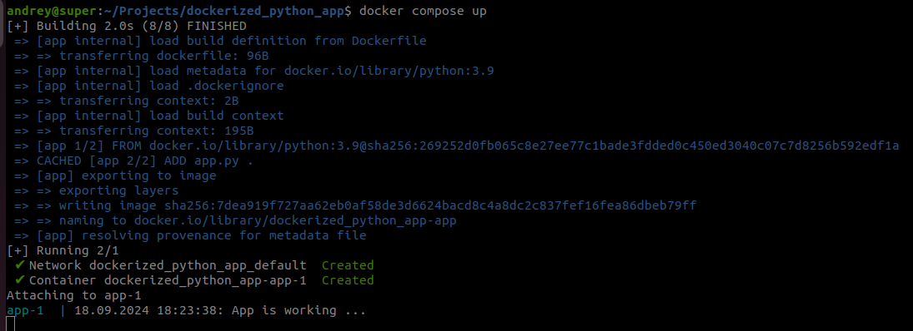
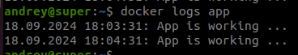

# Пример Python-приложения в Docker-контейнере

## Установка Docker и Docker Compose

Следуйте инструкции по ссылке:

https://docs.docker.com/engine/install/ubuntu/

Чтобы можно было запускать Docker без `sudo`, нужно добавить пользователя, от имени которого работаете в группу `docker`:

```bash
sudo usermod -aG docker <имя-пользователя>
```

закройте терминал и откройте снова. После этого Docker и Docker Сompose должны работать без sudo.

Если группа `docker` не существует, то нужно ее сначала создать:

```bash
sudo groupadd docker
```

## Запуск контейнера с приложением

Для запуска с помощью Docker Compose, выполните:

```bash
docker compose up
```



Для запуска с помощью Docker, сначала соберите образ для контейнера:

```bash
docker build -t app .
```

где `app` это имя образа, которое далее нужно использовать при создании контейнера, а `.` это путь к файлу `Dockerfile`. В данном случае используется `Dockerfile` расположенный в текущей папке.

Затем создайте контейнер из образа:

```bash
docker run --name app app
```

Данная команда создает контейнер из образа `app`, присваивает ему имя `app` и запускает.

Чтобы прервать работу контейнера, нужно нажать `Ctrl+C`.

Так как контейнер уже создан, то в следующий раз его нужно запускать командой:

```bash
docker start app
```

и останавливать командой

```bash
docker stop app
```

## Проверка работы приложения в контейнере

Для того чтобы убедиться, что приложение в контейнере app работает, можно посмотреть лог запущенного контейнера с помощью команды:

```bash
docker logs app
```

Приложение выводит текущую дату и надпись `App is working ...` каждую минуту, как показано на скриншоте:




